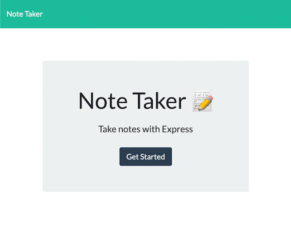

# Note Taker
  
  
   
  
             
    

  ## TABLE OF CONTENTS

  ---

  [Description](#description) *
  [Installation](#installation) *
  [Questions](#questions) 

   

  
  
   

  ## Description

  ---

  This application directs the user to a note-taking page where they can views, create, and delete notes.
    
  Deployment: (https://everyday-note-taker.herokuapp.com/)
   
  Repo: (https://github.com/sihayah/note-taker)

  

  ## Installation

  ---
  
   Navigate to the deployment url. Click the 'Get Started' link, and start entering your notes.
  

  ## Questions

  ---

  For any further inquiries, please contact me via gitHub: [(sihayah)](https://github.com/sihayah) or email: sihaya_a@hotmail.com

  

   
   
